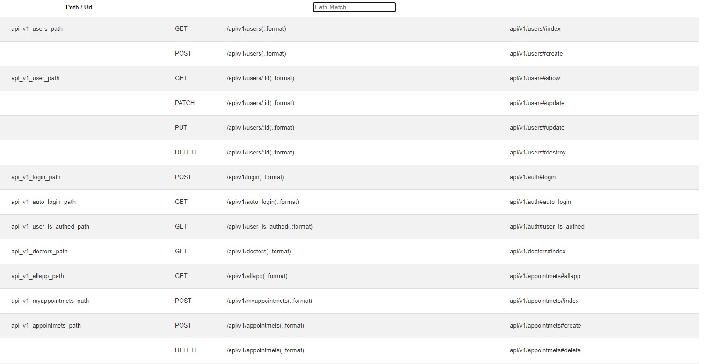

# Mother and Child Hospital JSON API WITH RAILS 6

A RESTFUL API built with Ruby on Rails. It uses JWT to implement Authentication & Authorization. In this project, I built a full-stack application where users can access the list of doctors and their detailed information as well as their appointments made with a specific Doctor. The project serves as my final capstone project at Microverse. The repo for the client app can be accessed [here](https://github.com/vmwhoami/mother_child_api)

## Routes



## Built With

- Ruby v2.7.2
- Ruby on Rails v6.1.3
- RSpec

## Live Demo

[Live Demo](https://mother-child.netlify.app)

## Getting Started

To get a local copy up and running follow these simple example steps.

### Prerequisites

Ruby: 2.7.1
Rails: 6.0.3.4
Postgres: >=9.5

### Setup

```bash
$ git clone https://github.com/vmwhoami/mother_child_api
$ cd danceter
```

Install gems with:

```
bundle install
```

Setup database with:

> make sure you have postgress sql installed and running on your system

```
   rails db:create
   rails db:migrate
```

### Usage

Start server with:

```
    rails server
```

Open `http://localhost:3000/` in your browser.

### Run tests

```
    rpsec
```

# Authors

👤 **Vitalie Melnic**

- Github: [@vmwhoami](https://github.com/vmwhoami)
- Twitter: [@vmwhoami](https://twitter.com/vmwhoami)
- Linkedin: [vitalie-melnic](https://www.linkedin.com/in/vitalie-melnic/)

## 🤝 Contributing

Contributions, issues and feature requests are welcome!

Feel free to check the [issues page](issues/).

## Show your support

Give a ⭐️ if you like this project!

## Acknowledgments

- Microverse
